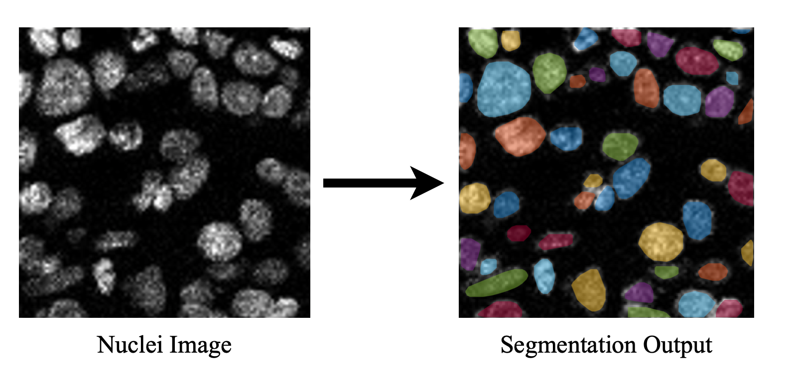

# Cell-Segmentation

The cell segmentation framework presented here is just for review purposes. 

 

## Requirements
To be able to run the cell segmentation framework, one needs the following:

* [Matlab](https://www.mathworks.com/products/matlab.html)
* [Matlab Computer Vision Toolbox ](https://www.mathworks.com/products/computer-vision.html)
* [Matlab Image Processing Toolbox](https://www.mathworks.com/products/image.html)
* [Python 3.7.9](https://www.python.org/downloads/release/python-379/)

## Usage
As our system is a hybrid model, you need to first create a python virtual environment (our working version of python is 3.7.9) where you can install all the required packages. Let us imagine you are using the conda platform to create your virtual environment. These are the steps you need to follow. 

This section is done on a terminal window.

First, let us create the virtual environment:

`conda create -n circle_virtual_environment python=3.9
`

Next, you need to activate the virtual environment:

`conda activate circle_virtual_environment `

Then you need to install all the requirements within the MaskRCNN. For simplicity of the repo, we are providing just the code snippets that are needed for inference from the MaskRCNN repo (available [here](https://github.com/matterport/Mask_RCNN/)).

Next, you need to change the directory where the repo is downloaded inside the MaskRCNN directory and install all the required packages. 

`cd [path_to_where_the_repo_is_downloaded]\Lib\MaskRCNN`

and then

`pip install -r requirements.txt`

Once you have the `circle_virtual_environment` ready, you can run the code. To run the code, you can easily set up your sample image file in `demo.m` (in the main directory) and then run it. 

Please note that we are providing scripts for batch processes (to run on a whole folder), which is the `run.m` script. Line 4 of the `run.m` provides the path to a configuration file where the user can easily set up the input and output path in a CSV file. 

Please remember that the weights for the deep learning model are available for download from the link [here](https://drive.google.com/file/d/1C3jcOiDjyMAtvB9SsxKDQGMfnbkOwXyW/view?usp=sharing). You need to put this file (.h5 file) inside the MaskRCNN folder ([~/Cell-Segmentation/Lib/MaskRCNN]()). 
